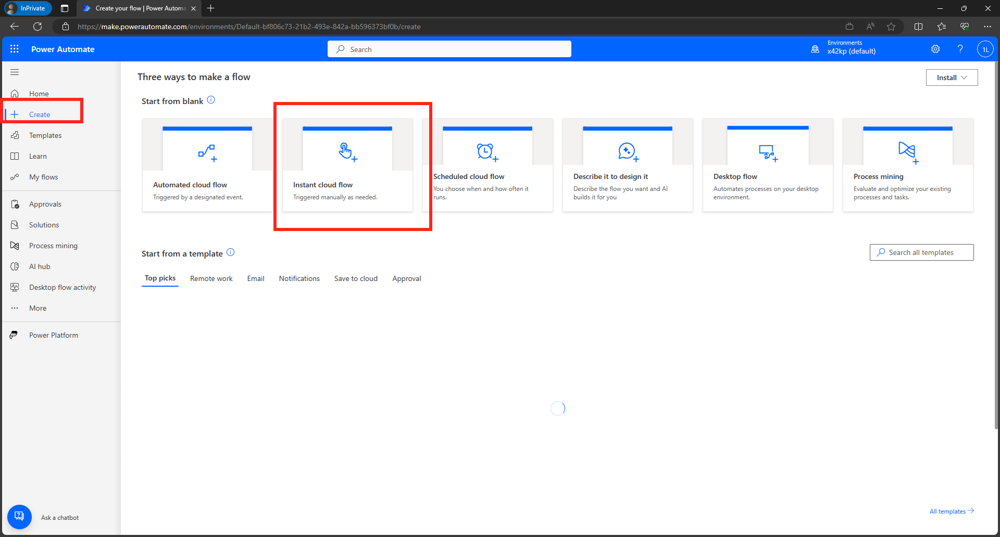
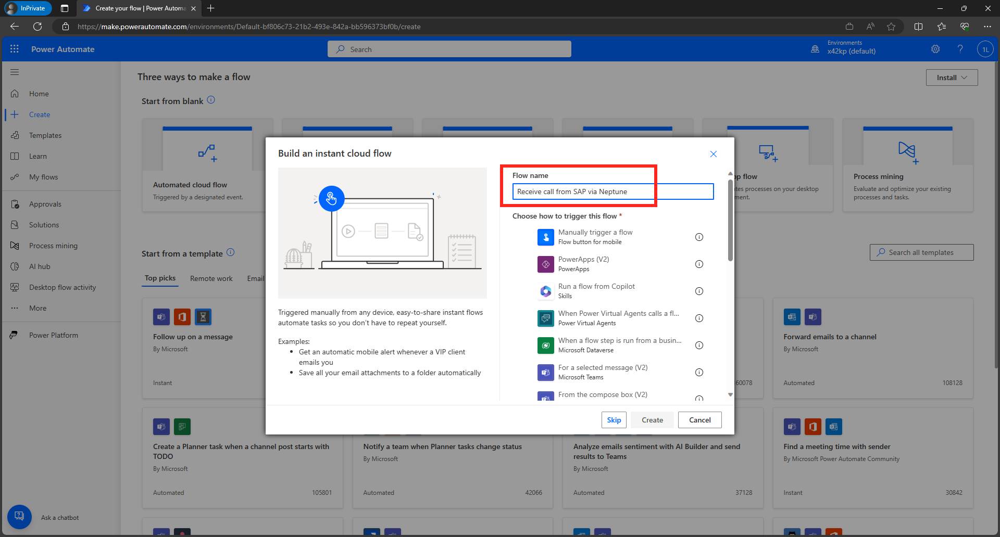
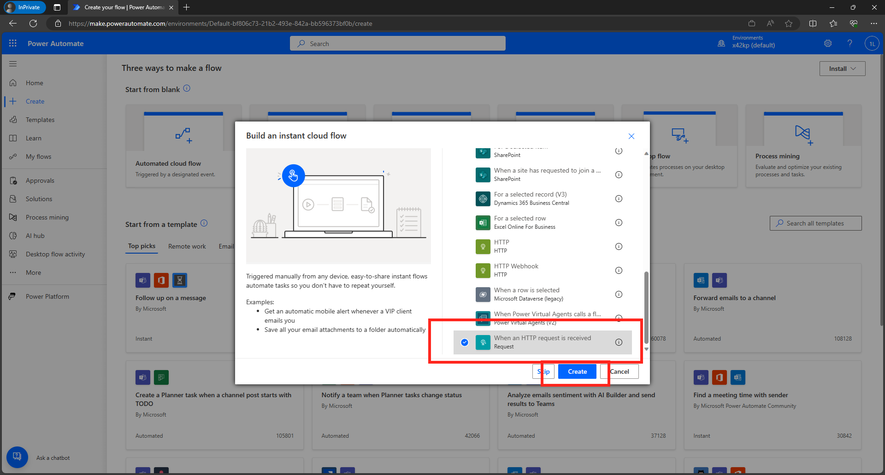
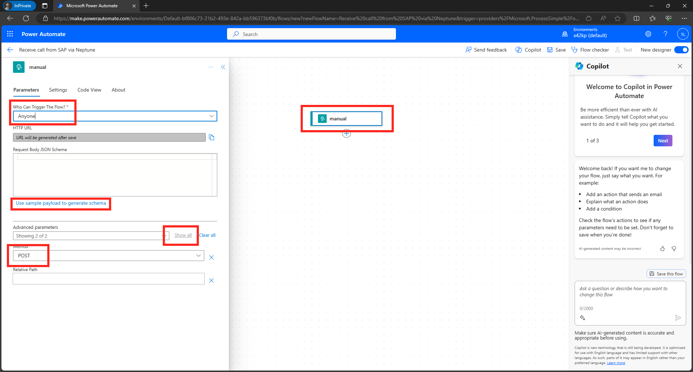
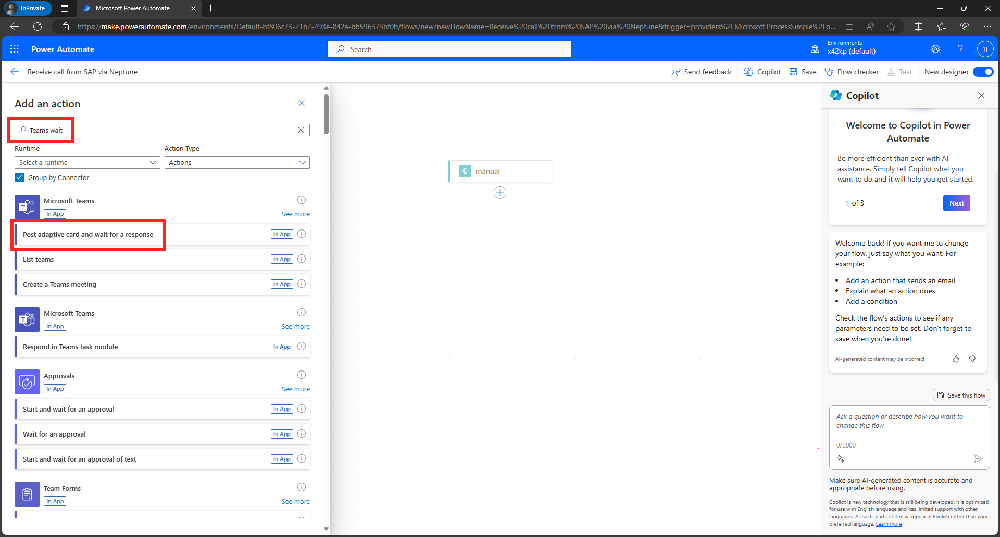

# DSAGTechXChange - No-Code/Low-Code Challenge

Hands-on Session as part of the [DSAG TechXChange 2024](https://dsag.de/wp-content/uploads/2023/12/Programm_und_Agenda_DSAG-TechXchange.pdf)


## Sign up to the Netpune Developer Trial
Go to https://www.neptune-software.com/free-trial/ scroll down and click on "Download Free Trial"


## TODO:  Sign up to the Microsoft 365 Developer Program
https://developer.microsoft.com/en-us/microsoft-365/dev-program


## TODO: Sign up to the Power Platform Developer Trial
Go to https://powerapps.microsoft.com/en-us/developerplan/ and sign up for the "Power Apps Developer Plan"


Fill in the required information. 


**Note:** If you have problems signing in with your work / school account, go to https://developer.microsoft.com/en-us/microsoft-365/dev-program and sign up for the Microsoft 365 Developer Program first. 

## Create your first Power Automate Flow


* Go to https://make.powerautomate.com/ 


**Note**: Normally you would group and package all your flows in a solution. However, since we are going to only create one flow in our scenario, we create our flow in the default solution

* Click on "+ Create"


* Select "Instant Cloud Flow"


* Give the flow a name, e.g. Receive call from SAP via Neptune


* Select "When an HTTP request is received" from the very end of the list of available triggers, then click on "Create"


* In the designer screen click on manual and change the following properties on the left hand side:
**Note:** You need to click on Show all under "Advanced parameters" to see all required settings
- Who Can Trigger The Flow: Anyone
- Method: POST




* Click on "Use sample payload to generate schema" and paste the following JSON sample (this is what is sent from Neptune to our Power Automate flow). Then click on "Done"
```
{
    "messageID": 111,
    "messageText": "Hello, World!"
}
```


* Now add a new step to send an Adaptive Card to Teams. Click on the "+" sign under our trigger step "manual" and then "Add Action"


* In the "Add an action" search filed, enter "Teams wait" and select "Post adaptive card and wait for a response"


* Click on Sign-in to connect the Power Automate flow with Teams. Sign-in with your Microsoft 365 user. 


* Select the Channel and Teams where the Adaptive Card should be posted


* Paste the content for the adaptive card from below in the Message field


```json
{
    "$schema": "http://adaptivecards.io/schemas/adaptive-card.json",
    "type": "AdaptiveCard",
    "version": "1.2",
    "body": [
        {
            "type": "TextBlock",
            "size": "Medium",
            "weight": "Bolder",
            "text": " Approve SAP Workflow @{triggerBody()?['messageID']} via  Neptune",
            "horizontalAlignment": "Center",
            "wrap": true,
            "style": "heading"
        },
        {
            "type": "TextBlock",
            "text": "@{triggerBody()?['messageText']}",
            "wrap": true
        },
        {
            "type": "Input.Text",
            "id": "comment",
            "label": "Comment"
        }
    ],
    "actions": [
        {
            "type": "Action.Submit",
            "title": "Approve"
        },
        {
            "type": "Action.Submit",
            "title": "Reject"
        }
    ]
}
```


**Note**: If you want to desing your own adaptive card, you can go to https://www.adaptivecards.io/designer/

* Save the Power Automate Flow


* Click on the manual trigger action and copy the HTTP POST URL. This is the URL that will be used on the Neptune side to trigger the flow. 


* Using Postman (or another REST Client), call the URL providing a sample payload
!!!PICTURE!!!

* Open up [Teams](https://teams.microsoft.com/) and navigate to the Channel you had specified. If everything worked fine, you should see an adaptive card. 


* Now we need to add the functionality the Approve / Reject the incoming workflow. The Teams action is actually waiting for a response, so we can add a Condition that allows us to send an HTTP response back to the SAP system. 
"Under the Post adaptive card and wait for a response" action, click on the "+" and "Add an action"


* Search for Condition and click on the action


* In the Condition action, click on "Choose a value" and select "fx"


* Enter the fx to take the response from the Teams action

```
body('Post_Adaptive_Card_and_wait_for_a_response')?['submitActionId']
```


* Now enter the value that we are checking: Approve


* In the True branch of the Condition flow, click on "+" and "Add an Action"


* Search for HTTP and select the HTTP action


* Add the URL to the Endpoint on the SAP side 

* This is how the flow overall should look like


