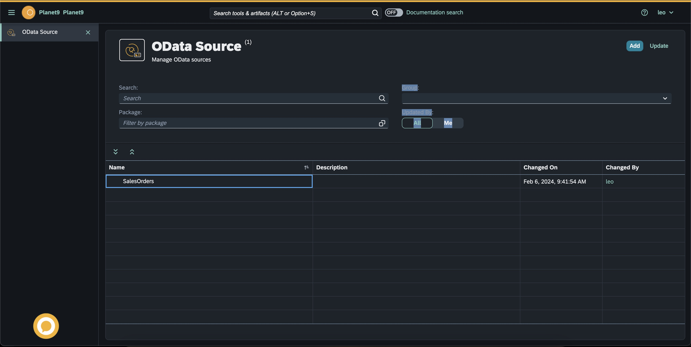
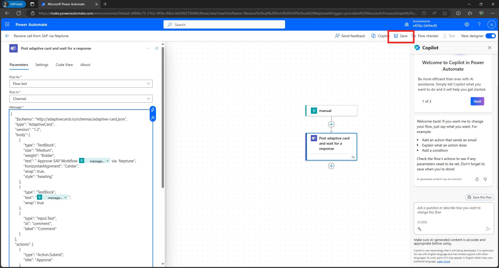
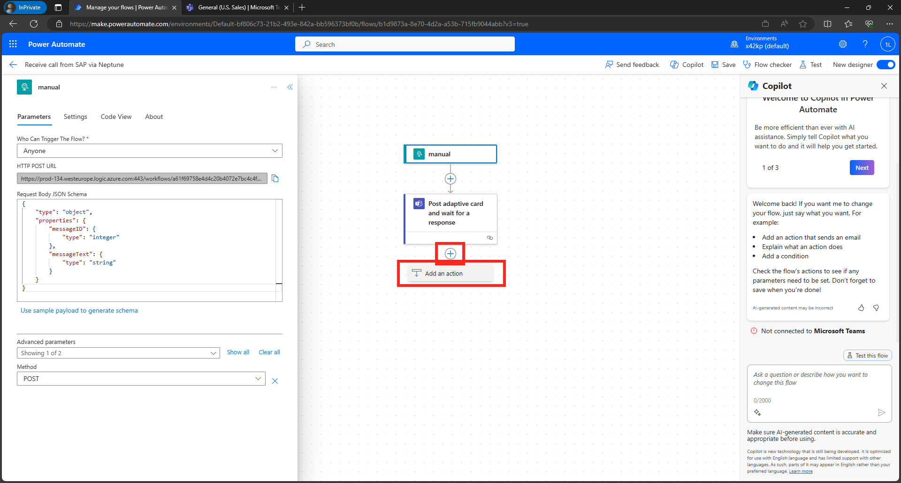
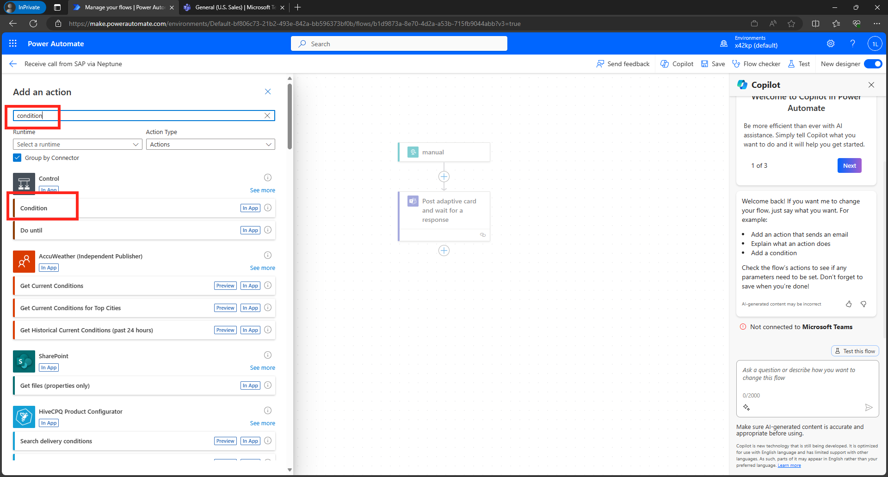
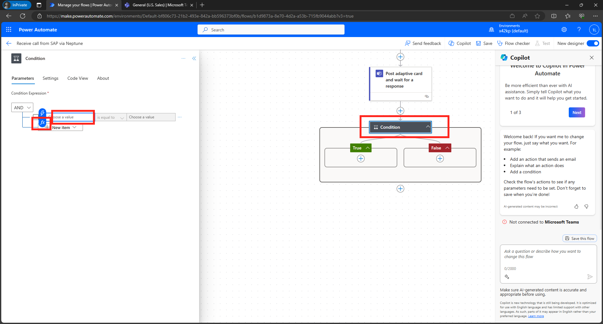
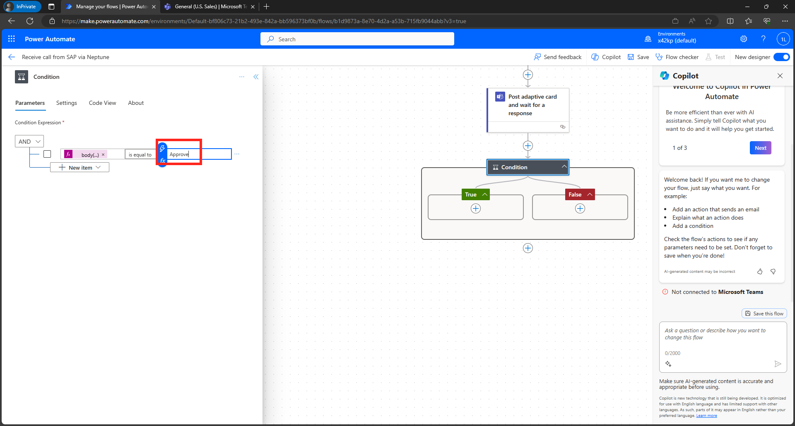

# DSAGTechXChange - No-Code/Low-Code Challenge

Hands-on Session as part of the [DSAG TechXChange 2024](https://dsag.de/wp-content/uploads/2023/12/Programm_und_Agenda_DSAG-TechXchange.pdf)

## 🥅 Goal

In this session we want to show how easiy it is to combine the strength of Neptunes DXP platform to build UI5 apps in a low-code approach and combine this with a Power Automate flow to send approval notifications to Teams. 

As a result you will have a simple App, that allows you to create a new Sales Order, then see the notification in Teams and approve it directly from there. 


## 🤝 Neptune DXP

Login to the Neptune Cockpit

https://gtmdemosystem.neptune-software.cloud/cockpit.html

- Username: techexchange
- Password: techexchange2024

### Neptune App Designer

We will start by creating a new Neptune app with the App Designer.

- Download the following planet9 file from https://github.com/hobru/DSAGTechXChange-Neptune-PowerPlatform/blob/main/dsag_tech_exchange_salesorders.planet9 and store it locally.

- From the Neptune Cockpit start the App Designer Tool by clicking on the tile
  

- In the dialog select "New from file"
  

- Select the planet9 file you downloaded before from this GitHub repository
  

- Fill in a name for the app like salesorder_approval_xx (For xx use the number of the group to make the app unique)
  

- Test the application by pressing run
  

### Connect OData Service + REST Services

In the Cockpit open the OData Source Tool and search for the SalesOrders service



This is the service we will use in our application

Return to the App Designer

- Drag the ODataSource from the tree to the Resource and rename it SalesOrderOData


- Drag the RestAPI from the tree to Resource and rename it to TriggerPowerAutomate


### Test the app

Run the application again and check if the Sales Orders are displayed in the list and you can click a item from the list to see the details


### Implement the trigger button

Search for the TriggerButton in the UI tree and select it


On the right side in the panel click the button next to the press function


We can now adjust the JavaScript code and add the following logic to call the trigger API

```js
var options = {
  parameters: {
    "api-version": "2016-06-01", // Optional
    sp: "%2Ftriggers%2Fmanual%2Frun", // Optional
    sv: "1.0", // Optional
    sig: "_UO6mNVAhQwYaFEdWBVsSZq_bolYF8Ee9iUL1BHvUK4", // Optional
  },
};

apiTriggerPowerAutomate(options);
```

### Run the application and trigger a call to Power Automate

TODO add screenshots when app is finished and store planet9 file also in this repo


## 🤝 Power Platform

Now that we have the Neptune app running, let's switch over to Power Automate. For this hands-on session, we have created an environment for you!

> [!NOTE]
>🏋🏽You can easily request a free M365 and Power Platform environment via these links 
> - [M365 Developer Program](https://developer.microsoft.com/en-us/microsoft-365/dev-program/)
> - [Power Platform Developer Program](https://powerapps.microsoft.com/en-us/developerplan/)


###  Create your first Power Automate Flow

- Go to https://make.powerautomate.com/
  

> [!NOTE]
> Normally you would group and package all your flows in a solution. However, since we are going to only create one flow in our scenario, we create our flow in the default solution

- Click on `+ Create`
  

- Select `Instant Cloud Flow`
  

- Give the flow a name, e.g. `Receive call from SAP via Neptune`
  

- Select `When an HTTP request is received` from the very end of the list of available triggers, then click on `Create`
  

- In the designer screen click on `manual` and change the following properties on the left hand side:
> [!NOTE]
> You need to click on Show all under `Advanced parameters` to see all required settings

* Who Can Trigger The Flow: `Anyone`
* Method: `POST`


* Click on `Use sample payload to generate schema` and paste the following JSON sample (this is what is sent from Neptune to our Power Automate flow). Then click on `Done`
```
{
    "messageID": 111,
    "messageText": "Hello, World!"
}
```


- Now add a new step to send an Adaptive Card to Teams. Click on the `+` sign under our trigger step "manual" and then `Add Action`
  

- In the `Add an action` search filed, enter `Teams wait` and select `Post adaptive card and wait for a response`
  

- Click on `Sign-in` to connect the Power Automate flow with Teams. Sign-in with your Microsoft 365 user.
  

- Select the Channel and Teams where the Adaptive Card should be posted
  

- Paste the content for the adaptive card from below in the Message field
  

```json
{
  "$schema": "http://adaptivecards.io/schemas/adaptive-card.json",
  "type": "AdaptiveCard",
  "version": "1.2",
  "body": [
    {
      "type": "TextBlock",
      "size": "Medium",
      "weight": "Bolder",
      "text": " Approve SAP Workflow @{triggerBody()?['messageID']} via  Neptune",
      "horizontalAlignment": "Center",
      "wrap": true,
      "style": "heading"
    },
    {
      "type": "TextBlock",
      "text": "@{triggerBody()?['messageText']}",
      "wrap": true
    },
    {
      "type": "Input.Text",
      "id": "comment",
      "label": "Comment"
    }
  ],
  "actions": [
    {
      "type": "Action.Submit",
      "title": "Approve"
    },
    {
      "type": "Action.Submit",
      "title": "Reject"
    }
  ]
}
```

> [!NOTE]
> If you want to desing your own adaptive card, you can go to https://www.adaptivecards.io/designer/

- Save the Power Automate Flow
  

- Click on the `manual` trigger action and `copy the HTTP POST URL`. This is the URL that will be used on the Neptune side to trigger the flow.
  

> [!NOTE]
> You could now use Postman (or another REST Client), to call the URL with a sample payload


## 🤝 Switch back to Neptune DXP
Add the URL from above to your Neptune App. Then give it a try and trigger the Power Automate flow by clicking on Submit. 
TODO!!!

 

## 🤝 Switch back to Power Automate
- Open up [Teams](https://teams.microsoft.com/) and navigate to the Channel you had specified. If everything worked fine, you should see an adaptive card.
  


### Add Approve / Reject
- Now we need to add the functionality the Approve / Reject the incoming workflow. The Teams action is actually waiting for a response, so we can add a Condition that allows us to send an HTTP response back to the SAP system.

-  `Under the Post adaptive card and wait for a response` action, click on the `+` and `Add an action`
  

- Search for `Condition` and click on the action
  

- In the Condition action, click on `Choose a value` and select `fx`
  

- Enter the function below to take the response from the Teams action

```
body('Post_Adaptive_Card_and_wait_for_a_response')?['submitActionId']
```


- Now enter the value that we are checking: `Approve`
  

- In the `True branch` of the Condition flow, click on `+` and `Add an Action`
  

- Search for `HTTP` and select the `HTTP action`
  

- Add the URL to the Endpoint on the SAP/Neptune side
- TODO!!! Where / when do I get the URL from Netpune??

- This is how the flow overall should look like
  
